<div align="center">
  <!-- LOGO -->
  

  <h1>3D Milky Way Explorer</h1>

  <p>
    An interactive 3D journey through the Milky Way galaxy — explore star systems,
    dive into planetary systems, and navigate celestial bodies in real time.
  </p>

  <!-- BADGES -->
<p>
  
</p>

<p>
  
  
  
  
  
  
</p>

</div>


---

## 🌌 About the Project

**3D Milky Way Explorer** is a fully interactive, real-time 3D visualization of our galaxy and nearby star systems.

Unlike static space visualizations, this project allows users to:

- Navigate freely inside the Milky Way
- Enter star systems via warp transitions
- Explore planetary systems down to moons and belts
- Interact with celestial bodies using both UI and direct scene clicks

The project is built with a **state-driven navigation architecture**, ensuring smooth transitions between galaxy, star system, and planetary views.

---

## 🚀 Key Features

- 🌌 **Procedural Milky Way Galaxy**
- ⭐ **Multiple Star Systems**
  - Solar System
  - Sirius Binary System
  - Alpha Centauri Triple System
- 🪐 **Fully Modeled Planetary Systems**
  - Planets, dwarf planets, moons
  - Asteroid Belt & Kuiper Belt
- 🎥 **Advanced Camera Controls**
  - Warp-in / warp-out transitions
  - Focus & reset per system
- 🧭 **UI + 3D Scene Synchronization**
  - Click planets directly
  - Or navigate via the info panel
- ✨ **Dynamic Labels**
  - Distance-aware scaling
  - Context-sensitive visibility
- ⚡ **High Performance Rendering**
  - Instancing
  - Optimized geometries
  - Smart visibility management

---

## 🧭 Navigation Experience

1. **Galaxy View**
   - Free camera navigation
   - Select destinations (Solar System, Sirius, Alpha Centauri)
2. **Warp Transition**
   - Smooth animated entry into star systems
3. **Inner Space**
   - Planetary orbits
   - Moons & sub-systems
   - Focused exploration
4. **Return to Galaxy**
   - Animated exit with spatial scaling

---

## 🛠 Tech Stack

- **React**
- **React Three Fiber**
- **Three.js**
- **@react-three/drei**
- **WebGL**
- **Vite**
- **Tailwind CSS**

---

## 💻 Running Locally

```bash
npm install
npm run dev
```

---

## 📸 Previews

<table>
  <tr>
    <td align="center">
      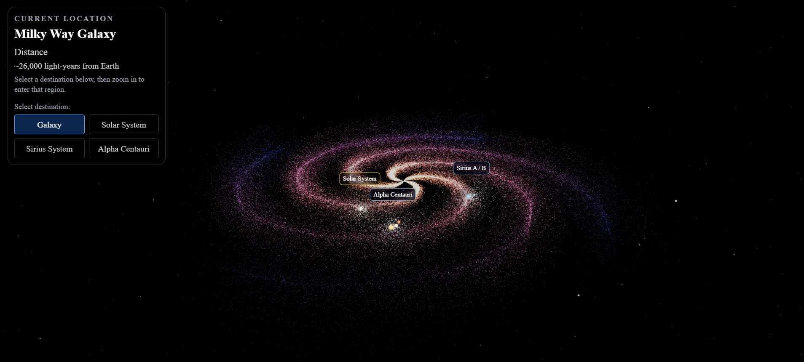
      <br />
      <sub>Milky Way — Galaxy overview</sub>
    </td>
    <td align="center">
      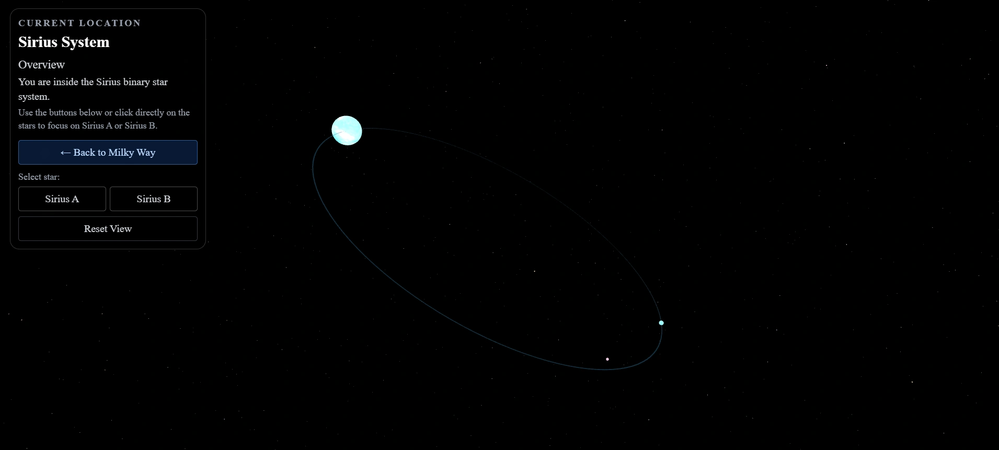
      <br />
      <sub>Sirius System — Inner system view</sub>
    </td>
  </tr>

  <tr>
    <td align="center">
      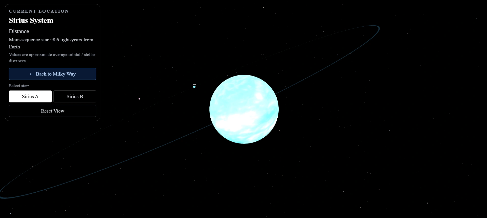
      <br />
      <sub>Sirius A — Focus view</sub>
    </td>
    <td align="center">
      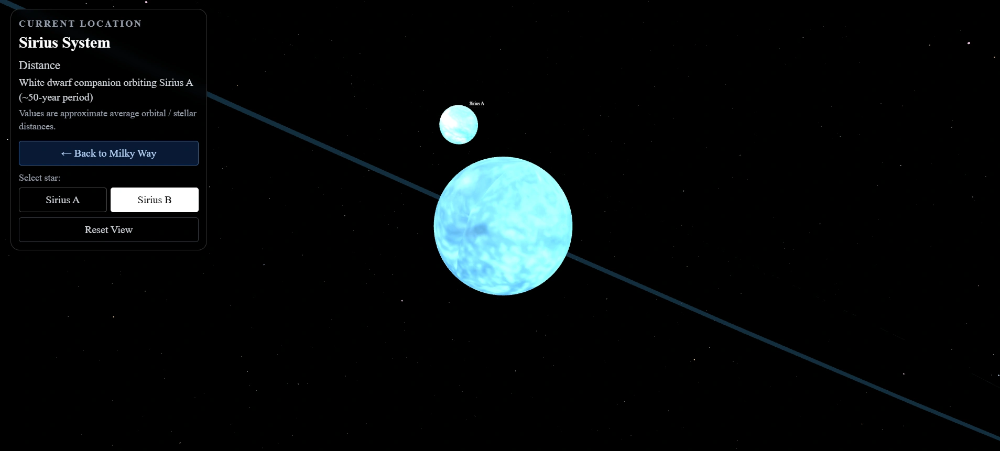
      <br />
      <sub>Sirius B — Focus view</sub>
    </td>
  </tr>

  <tr>
    <td align="center">
      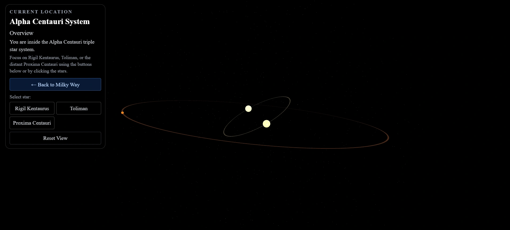
      <br />
      <sub>Alpha Centauri — Inner system view</sub>
    </td>
    <td align="center">
      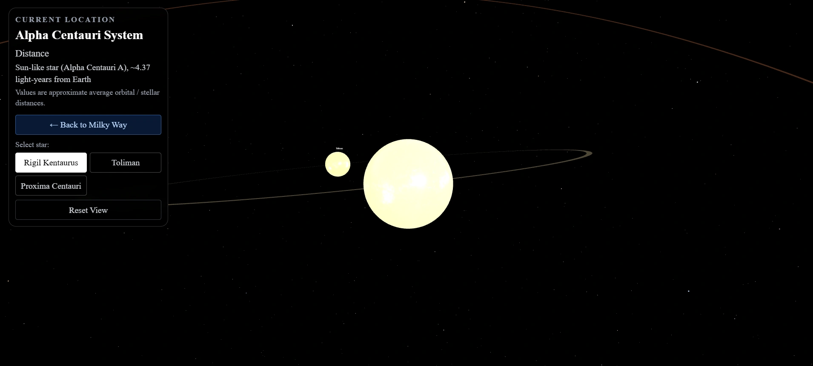
      <br />
      <sub>Rigil Kentaurus (Alpha Centauri A) — Focus view</sub>
    </td>
  </tr>

  <tr>
    <td align="center">
      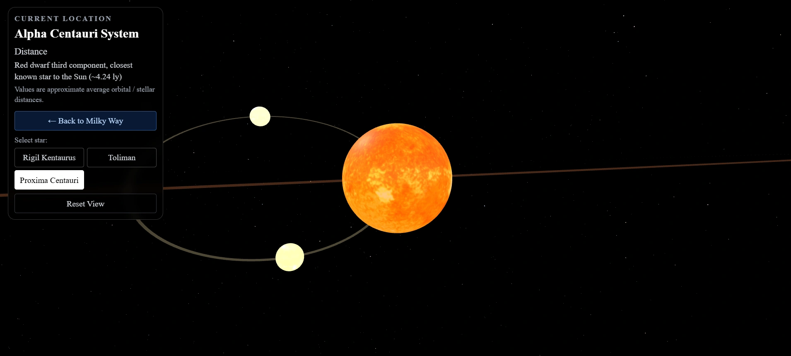
      <br />
      <sub>Proxima Centauri — Focus view</sub>
    </td>
    <td align="center">
      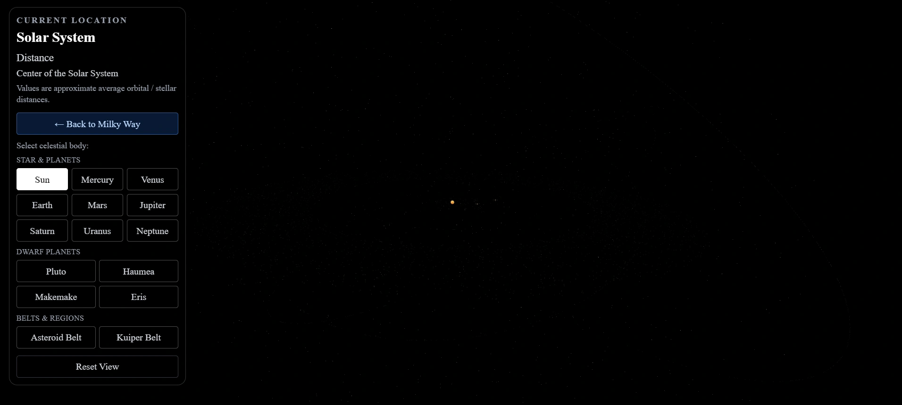
      <br />
      <sub>Solar System — Sun distant view</sub>
    </td>
  </tr>

  <tr>
    <td align="center">
      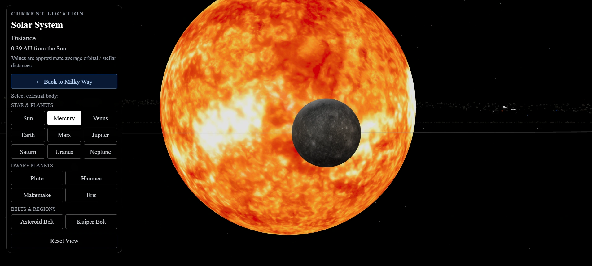
      <br />
      <sub>Mercury — Planet focus view</sub>
    </td>
    <td align="center">
      
      <br />
      <sub>Venus — Planet focus view</sub>
    </td>
  </tr>

  <tr>
    <td align="center">
      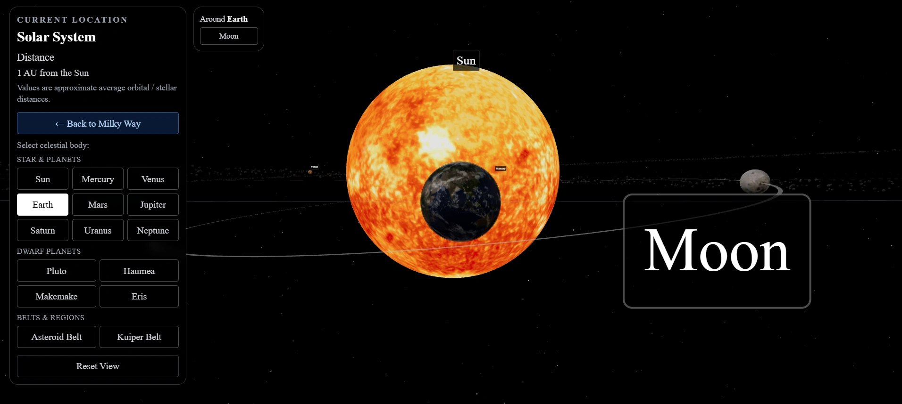
      <br />
      <sub>Earth — Planet focus view</sub>
    </td>
    <td align="center">
      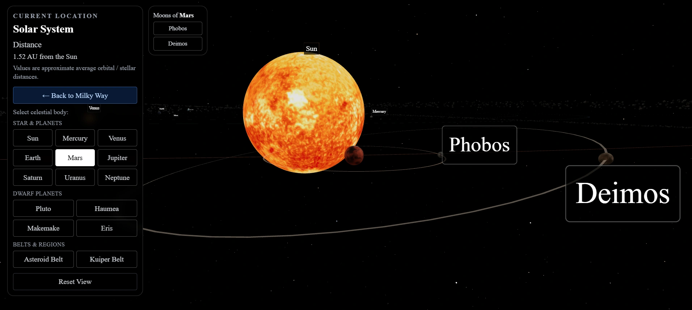
      <br />
      <sub>Mars — Planet focus view</sub>
    </td>
  </tr>

  <tr>
    <td align="center">
      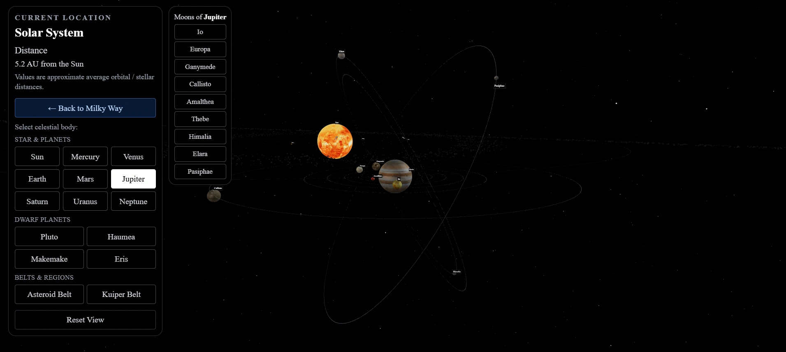
      <br />
      <sub>Jupiter — Planet focus view</sub>
    </td>
    <td align="center">
      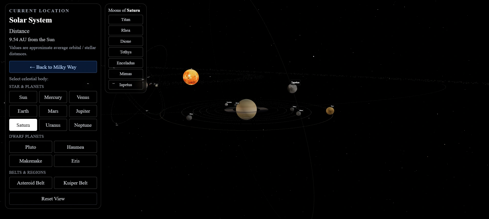
      <br />
      <sub>Saturn — Planet focus view</sub>
    </td>
  </tr>

  <tr>
    <td align="center">
      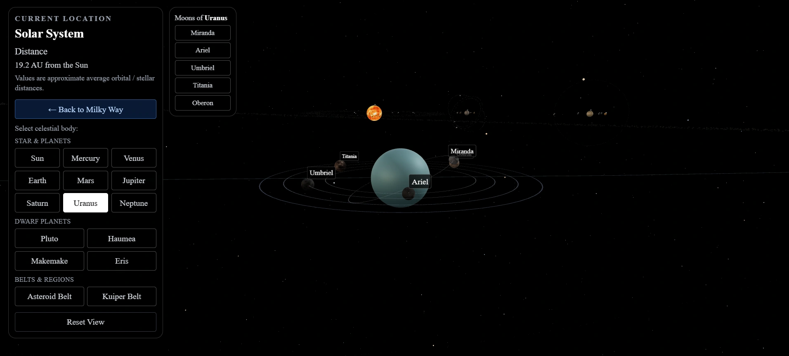
      <br />
      <sub>Uranus — Planet focus view</sub>
    </td>
    <td align="center">
      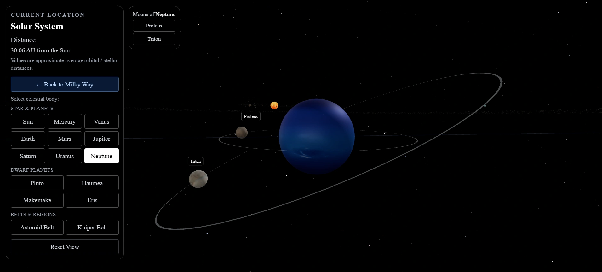
      <br />
      <sub>Neptune — Planet focus view</sub>
    </td>
  </tr>

  <tr>
    <td align="center">
      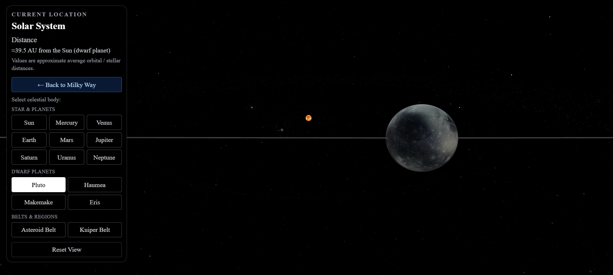
      <br />
      <sub>Pluto — Dwarf planet focus</sub>
    </td>
    <td align="center">
      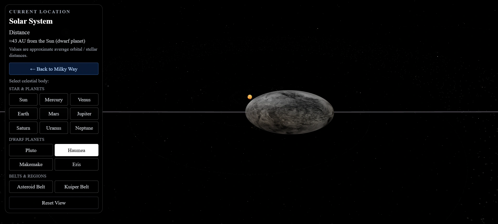
      <br />
      <sub>Haumea — Dwarf planet focus</sub>
    </td>
  </tr>

  <tr>
    <td align="center">
      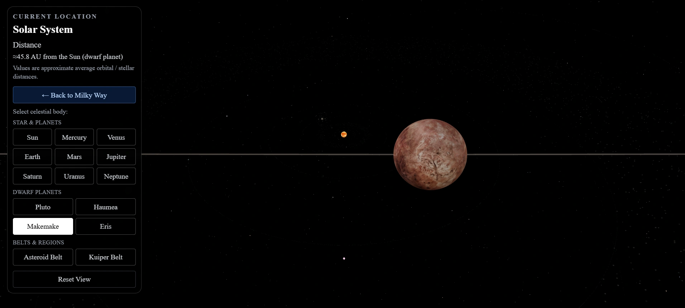
      <br />
      <sub>Makemake — Dwarf planet focus</sub>
    </td>
    <td align="center">
      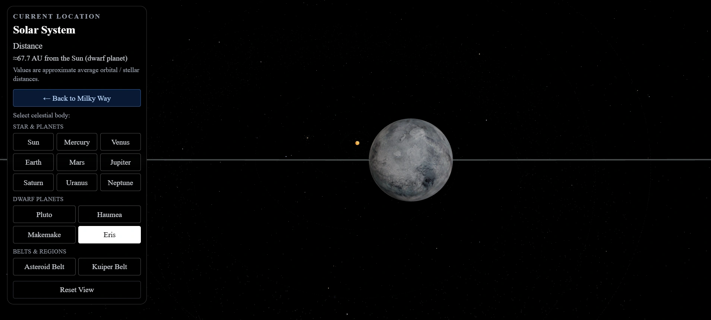
      <br />
      <sub>Eris — Dwarf planet focus</sub>
    </td>
  </tr>

  <tr>
    <td align="center">
      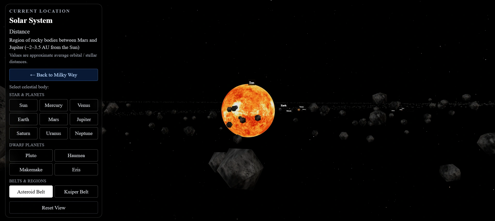
      <br />
      <sub>Asteroid Belt — Inner belt focus</sub>
    </td>
    <td align="center">
      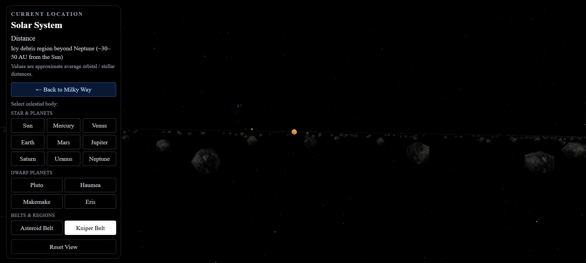
      <br />
      <sub>Kuiper Belt — Outer belt focus</sub>
    </td>
  </tr>
</table>

