<div align="center">
  <!-- LOGO -->
  

  <h1>3D Milky Way Explorer</h1>

  <p>
    An interactive 3D journey through the Milky Way — explore star systems,
    dive into planetary systems, and navigate celestial bodies in real time.
  </p>

  <!-- BADGES -->
  <p>
    
  </p>

  <p>
    
    
    
    
    
    
  </p>

  <!-- LIVE DEMO -->
  <p>
    🌐 <b>Live Demo:</b>
    <a href="https://3d-milkyway-explorer.vercel.app/" target="_blank">
      Try it on Vercel
    </a>
  </p>
</div>

---

## 🌌 About the Project

**3D Milky Way Explorer** is a real-time, fully interactive 3D visualization of the Milky Way and multiple featured destinations —
from familiar planetary neighborhoods to iconic nearby stars and deep-space highlights.

Unlike static space visualizations, this project lets you:

- Navigate freely inside the Milky Way
- Warp into star systems with smooth transitions
- Explore planetary systems down to moons, rings, and belts
- Inspect special deep-space objects (e.g., a supermassive black hole region)
- Interact with spacecraft and satellites rendered as 3D models

Built with a **state-driven navigation architecture**, the experience remains smooth while switching between
galaxy → system → focused exploration modes.

---

## 🚀 Key Features

- 🌌 **Procedural Milky Way Galaxy**
  - Instanced star field + optimized rendering
  - Label-driven destinations & clean UI navigation

- ⭐ **Multiple Star Systems & Destinations**
  - **Solar System**
  - **Sirius A / B** (binary system)
  - **Alpha Centauri** (triple system)
  - **Vega**
  - **Capella**
  - **Castor**
  - **Antares**
  - **Naos**
  - **Betelgeuse**
  - **Kepler-22**
  - **Sagittarius A\*** (supermassive black hole region)

- 🪐 **Fully Modeled Planetary Exploration**
  - Planets, dwarf planets, and moons
  - Asteroid Belt & Kuiper Belt
  - Context-aware focus views (planet → moon → belt)

- 🛰️ **Spacecraft & Orbital Assets (3D Models)**
  - Probes & missions (e.g., **Voyager**, **New Horizons**)
  - Space telescopes (e.g., **Hubble**)
  - Human-made orbital structures (e.g., **ISS**)
  - Interactive placement within the scene for cinematic exploration

- 🕳️ **Black Hole Experience**
  - Dedicated **Sagittarius A\*** destination
  - Focus-friendly visuals + deep-space ambiance
  - Designed to feel distinct from star/planet systems

- 🎥 **Advanced Camera & Navigation Controls**
  - Warp-in / warp-out transitions
  - Focus & reset per destination
  - Smooth “return to galaxy” scaling

- 🧭 **UI + 3D Scene Synchronization**
  - Click directly in the 3D scene
  - Or use the left info panel destinations

- ✨ **Dynamic Labels**
  - Distance-aware scaling
  - Context-sensitive visibility to reduce clutter

- ⚡ **High Performance Rendering**
  - Instancing + optimized geometries
  - Smart visibility management for heavy scenes

---

## 🧭 Navigation Experience

1. **Galaxy View**
   - Free navigation across the Milky Way
   - Select a destination (star systems, deep space objects, exoplanet system)

2. **Warp Transition**
   - Smooth animated entry into the selected region

3. **Focused Exploration**
   - Inner systems: planets, moons, belts
   - Stellar systems: highlight stars / components
   - Deep-space: special objects (e.g., Sagittarius A\*)

4. **Return to Galaxy**
   - Cinematic exit with spatial scaling

---

## 🛠 Tech Stack

- **React**
- **React Three Fiber**
- **Three.js**
- **@react-three/drei**
- **WebGL**
- **Vite**
- **Tailwind CSS**

---

## 💻 Running Locally

```bash
npm install
npm run dev
```

---

## 📸 Previews

<table>
  <tr>
    <td align="center">
      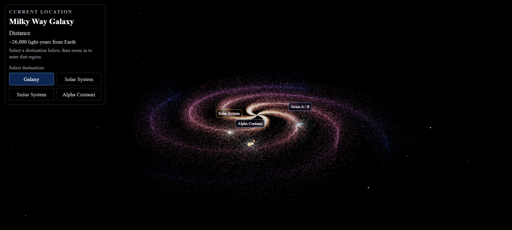
      <br />
      <sub>Milky Way — Galaxy overview</sub>
    </td>
    <td align="center">
      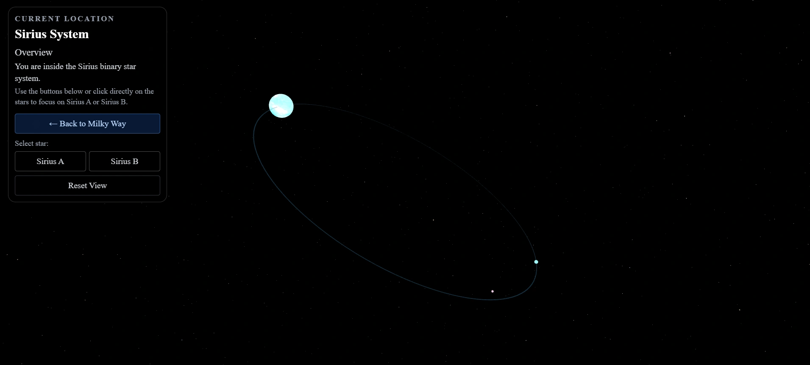
      <br />
      <sub>Sirius System — Inner system view</sub>
    </td>
  </tr>

  <tr>
    <td align="center">
      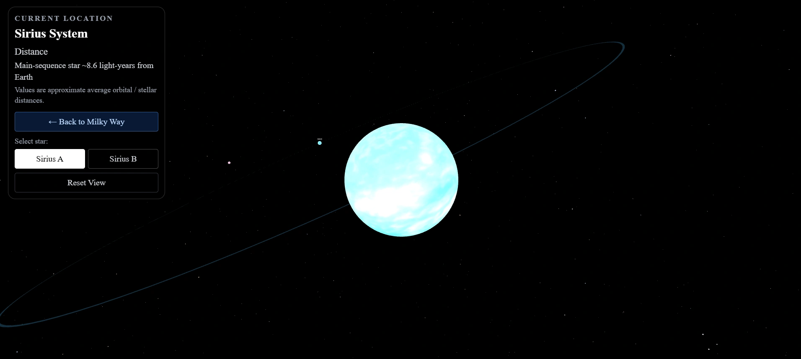
      <br />
      <sub>Sirius A — Focus view</sub>
    </td>
    <td align="center">
      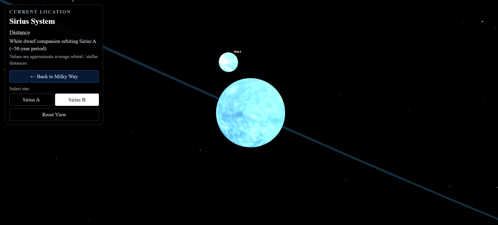
      <br />
      <sub>Sirius B — Focus view</sub>
    </td>
  </tr>

  <tr>
    <td align="center">
      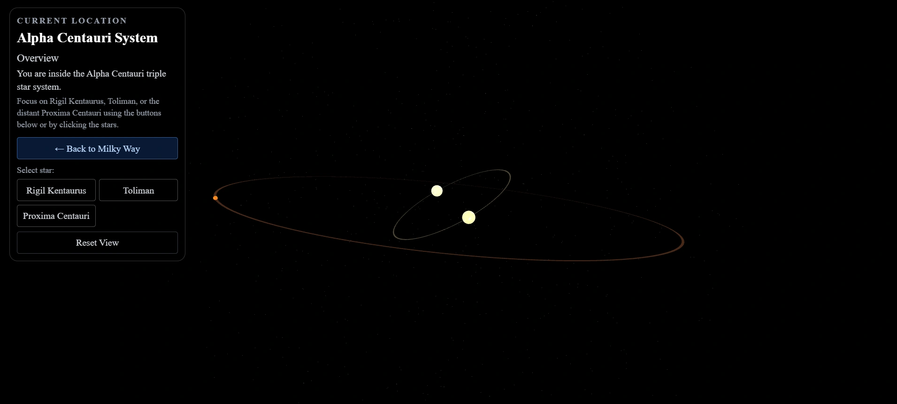
      <br />
      <sub>Alpha Centauri — Inner system view</sub>
    </td>
    <td align="center">
      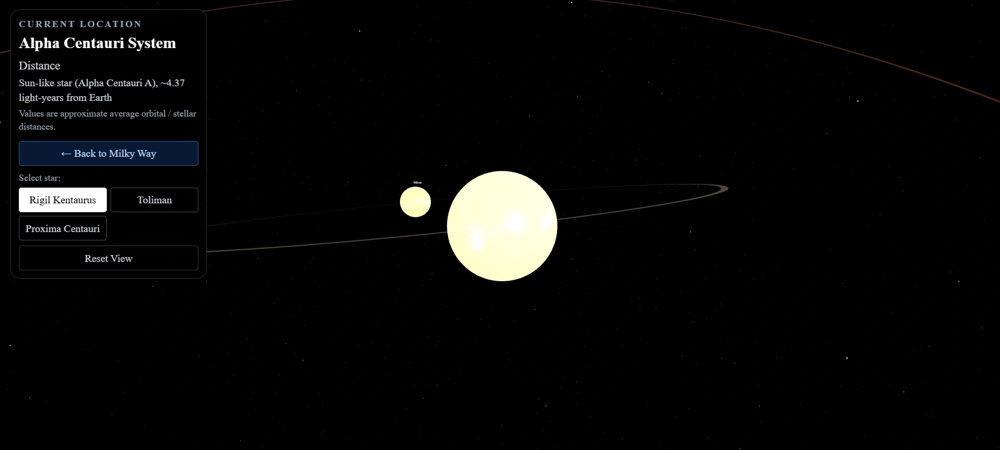
      <br />
      <sub>Rigil Kentaurus (Alpha Centauri A) — Focus view</sub>
    </td>
  </tr>

  <tr>
    <td align="center">
      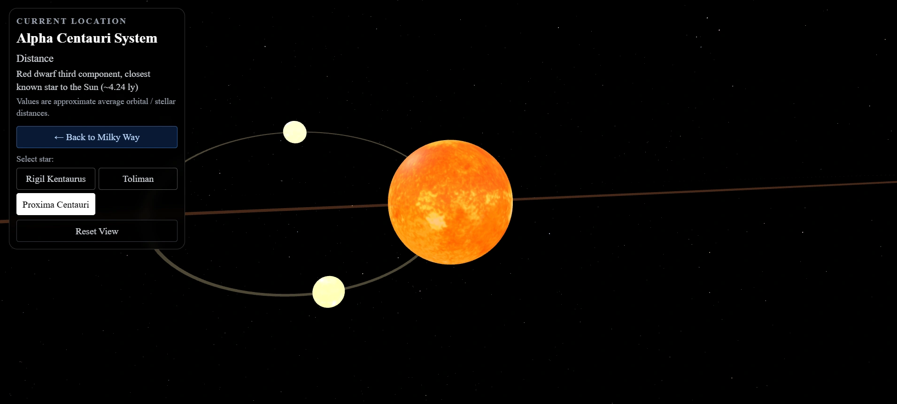
      <br />
      <sub>Proxima Centauri — Focus view</sub>
    </td>
    <td align="center">
      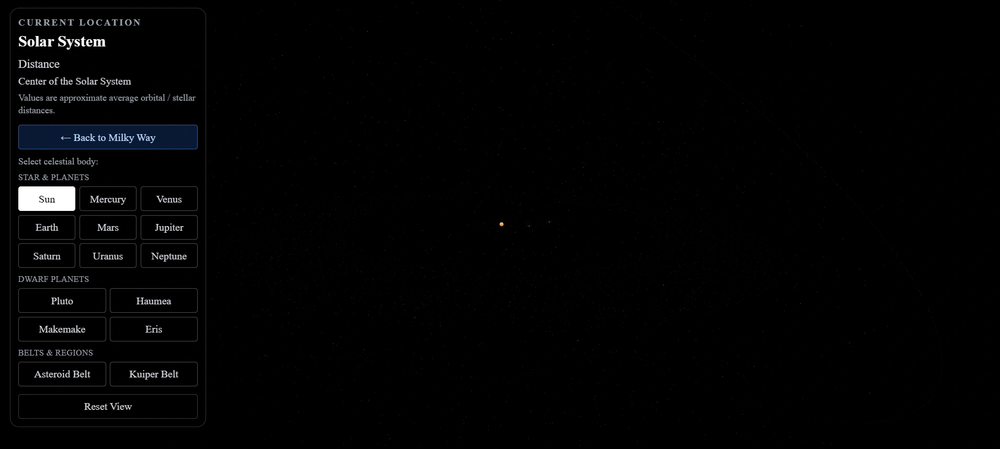
      <br />
      <sub>Solar System — Sun distant view</sub>
    </td>
  </tr>

  <tr>
    <td align="center">
      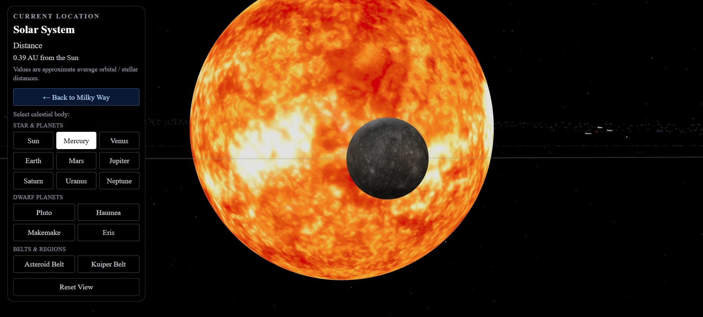
      <br />
      <sub>Mercury — Planet focus view</sub>
    </td>
    <td align="center">
      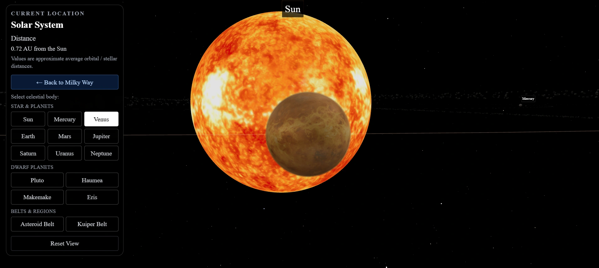
      <br />
      <sub>Venus — Planet focus view</sub>
    </td>
  </tr>

  <tr>
    <td align="center">
      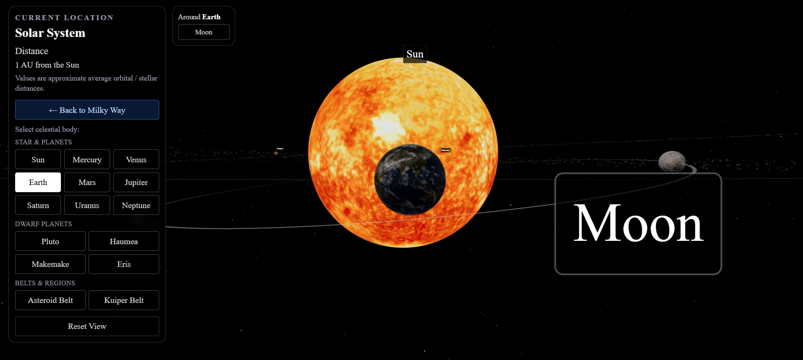
      <br />
      <sub>Earth — Planet focus view</sub>
    </td>
    <td align="center">
      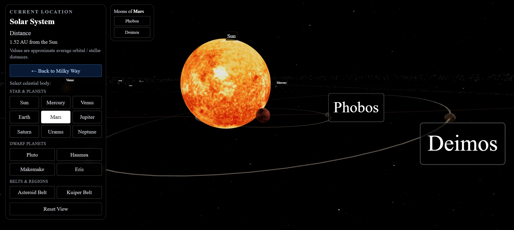
      <br />
      <sub>Mars — Planet focus view</sub>
    </td>
  </tr>

  <tr>
    <td align="center">
      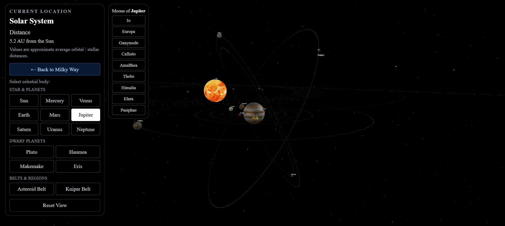
      <br />
      <sub>Jupiter — Planet focus view</sub>
    </td>
    <td align="center">
      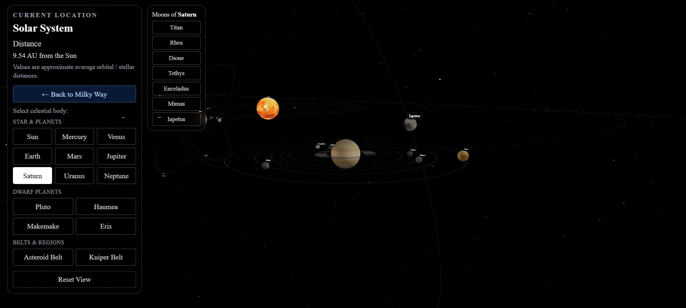
      <br />
      <sub>Saturn — Planet focus view</sub>
    </td>
  </tr>

  <tr>
    <td align="center">
      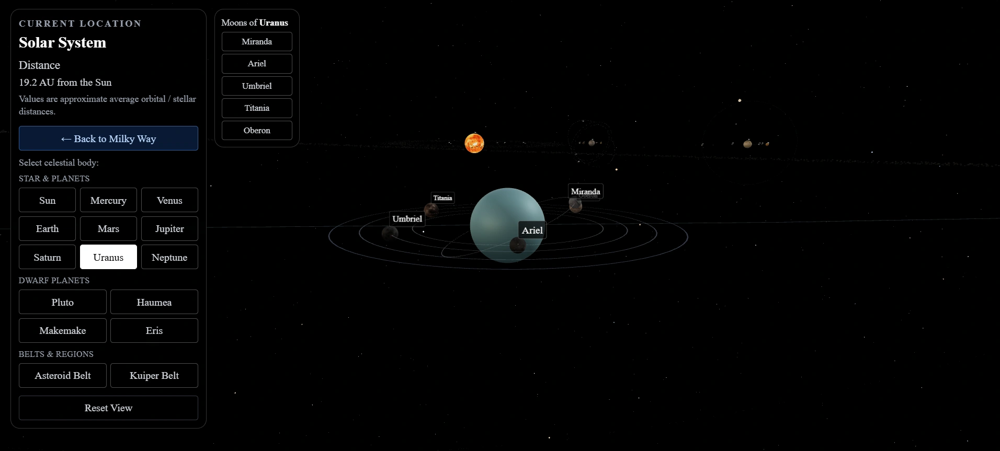
      <br />
      <sub>Uranus — Planet focus view</sub>
    </td>
    <td align="center">
      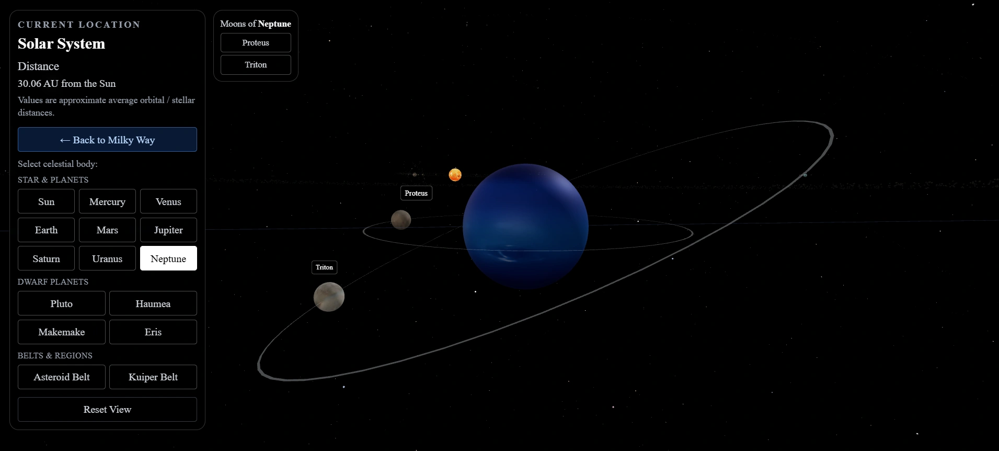
      <br />
      <sub>Neptune — Planet focus view</sub>
    </td>
  </tr>

  <tr>
    <td align="center">
      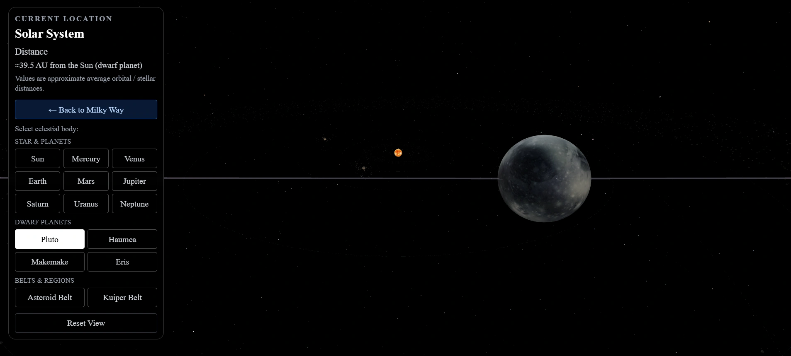
      <br />
      <sub>Pluto — Dwarf planet focus</sub>
    </td>
    <td align="center">
      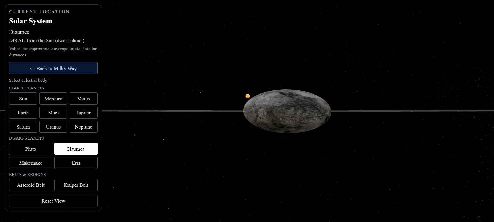
      <br />
      <sub>Haumea — Dwarf planet focus</sub>
    </td>
  </tr>

  <tr>
    <td align="center">
      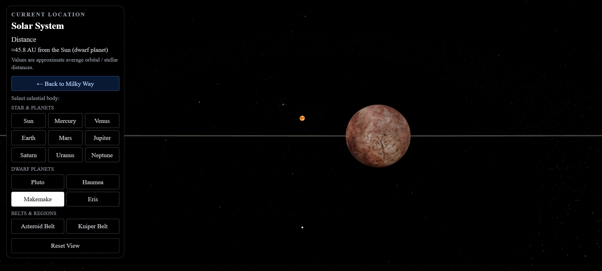
      <br />
      <sub>Makemake — Dwarf planet focus</sub>
    </td>
    <td align="center">
      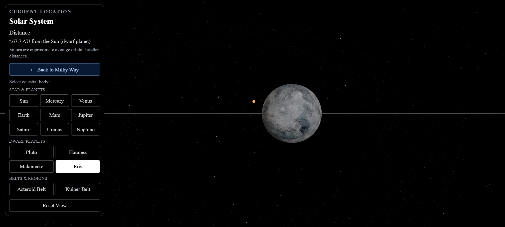
      <br />
      <sub>Eris — Dwarf planet focus</sub>
    </td>
  </tr>

  <tr>
    <td align="center">
      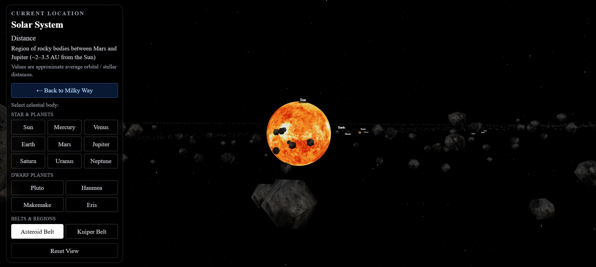
      <br />
      <sub>Asteroid Belt — Inner belt focus</sub>
    </td>
    <td align="center">
      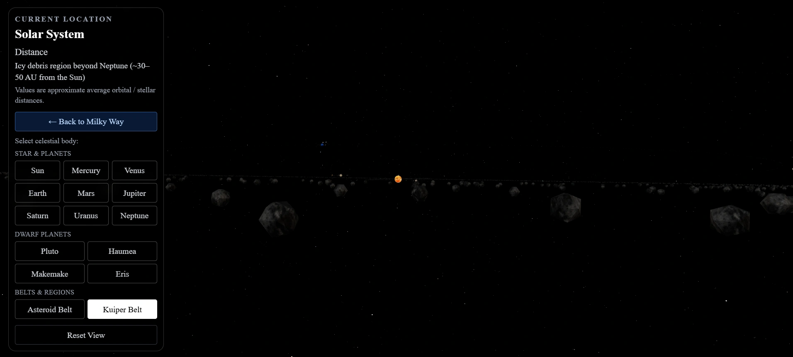
      <br />
      <sub>Kuiper Belt — Outer belt focus</sub>
    </td>
  </tr>
</table>

